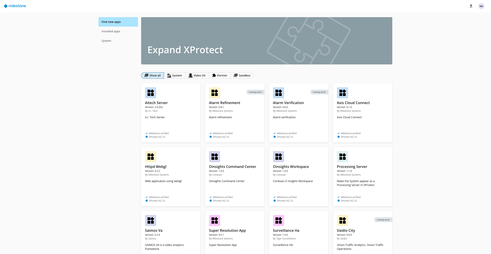

# App Center samples
This repository contains sample applications for the new Runtime Environment and App Center. 



## Setting up the environment for running the samples

In the following we assume that

* You have successfully run the installation wizard, which has set up a system consisting of one or more servers. The wizard deploys the new `Runtime Environment` to your Linux server and installs all essential services along with the App Center. The App Center acts as the main hub for installing, uninstalling, and updating applications.
* You have configured the system with the *sandbox* developer option enabled (use the `--cluster-sandbox` option for the installation wizard).
* You have configured the system with the *kubernetes dashboard* and *helm dashboard* enabled (use the `--cluster-dev-mode` option for the installation wizard)
* You have the credentials needed to SSH into one of the servers of the system (one of the master nodes).
* You have to run the `init` script in the [build/](build/init.sh) directory to get the latest app builder and install any missing dependencies.
* Remember to add the IP and port of your cluster's sandbox e.g. `10.10.10.10:5000` in the /etc/docker/daemon.json and restart the docker engine. `{"insecure-registries" : [ "10.10.10.10:5000" ]}`

For more infomration, see our [App Center and App Builder documentation](https://download.milestonesys.com/app-builder/Documentation/)

### Additional dependencies
To ensure everything runs smoothly, make sure the following tools are installed in the development machine:
* Docker – for containerization
* kubectl – to interact with Kubernetes clusters
* Helm – for managing Kubernetes applications
* curl – for making HTTP requests
* jq – for processing JSON
* yq – for processing YAML
* xclip (Linux) or pbcopy (macOS) – for clipboard access

## Samples
* [Hello World](src/hello-world/)
* [.NET Webserver](src/dotnet-webserver-sample/)
* [PostgreSQL](src/postgresql/)
* [Kafka Topics](src/kafka-topics/)
* [AIBridge & Prometheus](src/aibridge-prometheus-sample/)
* [API Gateway Webserver](src/apigateway-webserver-sample/)
* [RESTful Config API](src/restful-config-api/)

## How to run a sample
This repository is structured in two main directories. 

```bash
appcenter-samples
├── build
│   └── common.mak
├── README.md
└── src
    ├── aibridge-prometheus-sample
    ├── apigateway-webserver-sample
    ├── dotnet-webserver-sample
    ├── hello-world
    ├── postgresql-sample
    ├── restful-config-api
    └── utils
        └── auth.ps1
    ...
```

In the `build` directory, you'll find the `common.mak` file, which defines shared commands for building and managing the samples. Each sample directory includes its own `Makefile` that imports `common.mak` to leverage these commands. Under the hood, `common.mak` uses the App Builder (find more info [here](https://download.milestonesys.com/app-builder/Documentation/App-Builder.pdf)), which provides all the necessary commands to build, push, and install your application.

To work with a sample, navigate to its directory (where the `Makefile` is located) and run `make build` to build the Docker image and Helm chart for that sample.

`Note:` For the common.mak targets to work correctly, each sample must follow a consistent folder structure. Specifically:

- Application source code should be placed in a containers/ subdirectory, and each container must include a Dockerfile.


## Available Make Commands

##### 🛠️ Build & Bundle
- **`build`** – Build the Helm chart and Docker image for the sample.
- **`build-image`** – Create a Docker image from the application source code.
- **`bundle`** – Package the application and its dependencies into a deployable unit (e.g., Helm chart or Docker image).

##### 📦 Packaging
- **`push`** – Push the Helm chart and Docker image to a repository.
- **`push-image`** – Upload the Docker image to a container registry.
- **`remove-image`** – Delete the Docker image from the local system.
- **`clear-image-cache`** – Clear cached Docker images to free up space.

##### 📊 Helm Chart Management
- **`install-from-file`** – Install a Helm chart from a local `.tgz` file.
- **`install-from-repo`** – Install a Helm chart directly from a Helm repository.
- **`list`** – Display all available Helm charts.
- **`push`** – Upload a Helm chart to a Helm repository.
- **`remove`** – Delete a Helm chart from the cluster.
- **`uninstall`** – Uninstall a deployed Helm chart from the cluster.

##### 🔐 Authentication
- **`login`** – Authenticate with the running cluster.

##### 📈 Monitoring
- **`dashboard`** – Launch or access a web-based dashboard for managing deployments.
- **`events`** – Display recent events related to the application or cluster.

To better understand what each command does, you can run the desired command with the `-n` option (e.g., `make push -n`) to see what actions would be performed without actually executing them.

Each sample directory also contains an extended **README** file to help you better understand the specific application.
