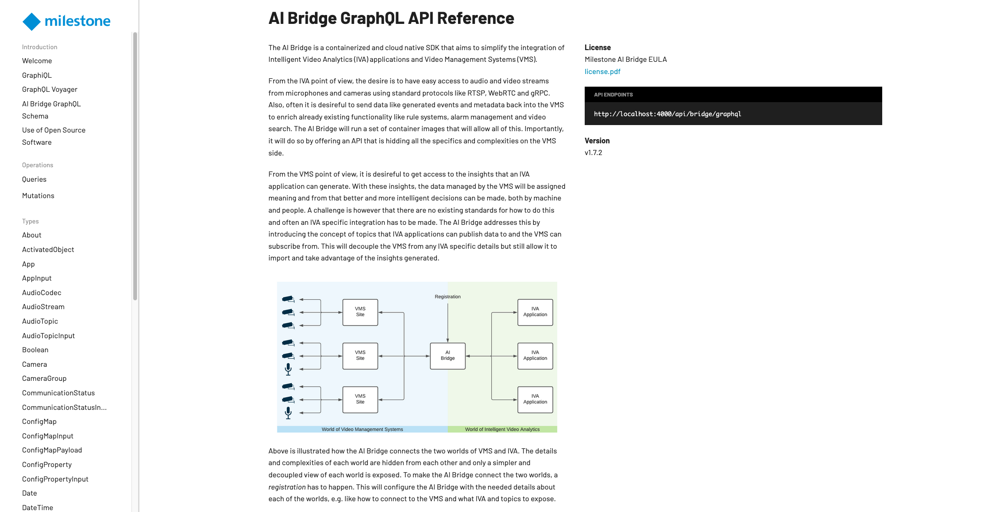

# The AIBridge & Prometheus Sample

The *AIBridge & Prometheus* sample demonstrates how to extract information from the VMS using AIBridge and create custom metrics in Prometheus.  
Find more information: [AIBridge](https://doc.milestonesys.com/AIB/Help/latest/en-us/index.htm), [Prometheus](https://prometheus.io/)

```
aibridge-prometheus-sample
├── containers
│   └── aibridge-prometheus-sample
│       ├── app
│       │   ├── Makefile
│       │   ├── requirements.txt
│       │   └── src
│       │       ├── app_setup.py
│       │       ├── __init__.py
│       │       ├── main.py
│       │       ├── routers
│       │       │   ├── __init__.py
│       │       │   └── router.py
│       │       ├── services
│       │       │   ├── aib
│       │       │   │   ├── graphql_queries.py
│       │       │   │   ├── __init__.py
│       │       │   │   └── service.py
│       │       │   ├── api
│       │       │   │   ├── __init__.py
│       │       │   │   └── service.py
│       │       │   ├── __init__.py
│       │       │   └── prometheus
│       │       │       ├── __init__.py
│       │       │       └── service.py
│       │       └── utils
│       │           ├── config.py
│       │           └── __init__.py
│       └── Dockerfile
├── Makefile
└── README.md
```

The structure is similar to previous samples, with the main code under the `containers` directory and Helm recipes under the `helm-charts` directory.

## Available Features

- **AIBridge GraphQL**: Queries to get VMS and camera information.
- **AIBridge App Registration**: Register this app as an AIBridge application.
- **Custom Prometheus Metrics**: Custom metrics for the number and duration of queries.
- **Grafana Dashboards**: Visualize custom metrics from Prometheus.

## Requirements

### Local Development

This sample targets `Python 3.12`. It is recommended to use a virtual environment.  
You can create and activate a virtual environment using `conda` or `pip`.  
With `pip`, run:

```bash
make init
```

This will:
- Create a virtual environment named `venv`
- Activate the environment
- Install dependencies from `requirements.txt`

**Note:**  
Before running `make build`, ensure you have run `make init` to create the `.env` file.

### Cluster Deployment

To run this sample in the cluster, install the **Processing Server** App via App Center in the Management Client context (plugin).

Since the app uses the client credentials flow, App Center will generate a client secret during installation.  
**Requirements:**
- The user must be an XProtect administrator and logged in to the Management Client.
- Installation must be done through the Management Client UI for App Center.

For development environments, a PowerShell script is provided to acquire tokens for two users:  
- The basic user entered during App Center installation.
- The Windows user you are logged in as.

> **Note:** The script must be run as a Windows administrator using PowerShell 7.

The script copies two `kubectl` commands to your clipboard to create Kubernetes secrets with the tokens.  
This is a workaround for development only and not recommended for production.

Once Processing Server is installed, you can access AIBridge documentation at `http://<system-ip>:4000`.



```powershell
$ErrorActionPreference = "Stop"

Try {
    $Server = Read-Host -Prompt 'Input hostname of Management Server'
    $User = Read-Host -Prompt 'Input username of basic user in the administrator role'
    $Pass = Read-Host -MaskInput -Prompt 'Input password of basic user'

    $Endpoint = "https://$Server:/IDP/connect/token"

    $Response = Invoke-WebRequest -AllowUnencryptedAuthentication -Uri $Endpoint -Method Post -Body @{
        grant_type = "password"
        username = $User
        password = $Pass
        client_id = "GrantValidatorClient"
    }
    $BUF_AccessToken = ($Response.Content | ConvertFrom-Json).access_token

    $Response = Invoke-WebRequest -AllowUnencryptedAuthentication -Uri $Endpoint -Method Post -Body @{
        grant_type = "windows_auth"
        scope = "write:client"
        client_id = "winauthclient"
    } -UseDefaultCredentials
    $CCF_AccessToken = ($Response.Content | ConvertFrom-Json).access_token

    Set-Clipboard ""
    Set-Clipboard -Append -Value "kubectl create secret generic app-registration-buf-token --from-literal='token=$BUF_AccessToken' --dry-run=client -o yaml | kubectl apply -f -"
    Set-Clipboard -Append -Value "kubectl create secret generic app-registration-ccf-token --from-literal='token=$CCF_AccessToken' --dry-run=client -o yaml | kubectl apply -f -"

    Write-Output "Your clipboard now contains the commands for creating the secrets necessary for using the basic user flow and client credentials flow"
}
Catch {
    Write-Output $_.Exception
}

Write-Host "Press any key to continue"
$void = $host.UI.RawUI.ReadKey("NoEcho,IncludeKeyDown")
```

**Expected output:**

```bash
kubectl create secret generic app-registration-buf-token --from-literal='token=eyJhbGc...' --dry-run=client -o yaml | kubectl apply -f -
kubectl create secret generic app-registration-ccf-token --from-literal='token=eyJhbGc...' --dry-run=client -o yaml | kubectl apply -f -
```

> The generated token expires after 3600 seconds. If you need authorization after this period, repeat the process.

## App Sandbox

Once the Helm chart of an app is pushed to the sandbox repository, it becomes visible in App Center, where you can install, upgrade, and uninstall your app.  
For a Helm chart to be considered an app, it must use the `app-registration` chart as a *subchart* (see [`Chart.yaml`](./helm-charts/aibridge-prometheus-sample/Chart.yaml)).

### How to Enable Sandbox

When running the [installation wizard](https://download.milestonesys.com/private-cloud/), use the `-sandbox` flag to enable the sandbox.  
Optionally, use the `dev-mode` flag to enable the Kubernetes and Helm dashboards for debugging.

The Helm chart can be pushed to the sandbox Helm repository at `http://<system-ip>/app-sandbox`.  
We use [ChartMuseum](https://chartmuseum.com/) as the backend. See [API documentation](https://github.com/helm/chartmuseum?tab=readme-ov-file#api).

The [`Makefile`](./Makefile) provides a convenient way to build and publish both images and Helm charts for the sample.

## Building and Running the Sample App

The [`Makefile`](./Makefile) provides an easy way to build and publish both images and Helm charts for the sample.

**Key targets:**

```bash
# Build container images and Helm charts
make build
# Push built images and Helm charts to the App sandbox
make push

# Build Helm charts only
make build-chart
# Push Helm charts only
make push-chart

# Install Helm charts from local file
make install-chart-from-file
# Install Helm charts from sandbox repository
make install-chart-from-repo
# Uninstall Helm charts
make uninstall-chart
```

### Docker View

To build the sample, navigate to the directory containing the `Makefile` and run:

```bash
make build
```

After a successful build, check your images:

```bash
docker images
```

You should see:

```txt
REPOSITORY                                                     TAG       IMAGE ID       CREATED         SIZE
<system_ip_addr>:5000/sandbox.io/aibridge-prometheus-sample    1.0.0     78f2c9d669b6   6 seconds ago   326MB
```

To see the build commands without executing them, use:

```bash
make -n build
```

To push the image to the sandbox registry:

```bash
make push
```

To verify the push:

```bash
docker rmi <system_ip_addr>:5000/sandbox.io/aibridge-prometheus-sample:1.0.0
docker pull <system_ip_addr>:5000/sandbox.io/aibridge-prometheus-sample:1.0.0
```

### Helm Chart View

Build the Helm chart:

```bash
make build
```

You will see a file like `aibridge-prometheus-sample-1.0.0.tgz` in the `helm-charts` directory.

To push the chart to the sandbox repository:

```bash
make push-chart
```

To confirm upload:

```bash
make list-charts
```

You should see output similar to:

```yaml
apiVersion: v1
entries:
  aibridge-prometheus-sample:
  - apiVersion: v2
    appVersion: 1.0.0
    ...
```

The app should now be visible in App Center.

To install from the terminal:

```bash
make install-chart-from-file
make install-chart-from-repo
```

To verify the app is running:

```bash
curl -X GET http://<system-ip>/aibridge-prometheus-sample/api/get-server-status
```

This ensures your app is up and running.

To uninstall:

```bash
make uninstall-chart
```

### Running the App Locally vs. in the Cluster

If you have created a virtual environment and installed requirements, run the app locally from `aibridge-prometheus-sample/containers/aibridge-prometheus-sample/app`:

```bash
make
```

The `.env` file contains the URLs for AIBridge and Prometheus.  
When running locally, you may need to deploy AIBridge, Prometheus, and Grafana locally (e.g., with Docker Compose) and update the `.env` file accordingly.

For cluster deployment, use the Makefile as described above.  
**Remember:** Install the **Processing Server App** before this sample.

## AIBridge

AIBridge provides integration with XProtect on Windows App Center.  
To use **AIBridge**, install the Processing Server plugin in the Management Client ([download here](https://download.milestonesys.com/aibridge/plugins/)), and install the **Processing Server** app in App Center.

AIBridge allows you to get video, VMS/camera info, send events, etc.  
For example, to get video via RTSP from a deployed app in the cluster:

```
rtsp://aibridge-streaming.processing-server:8554/camera-id/stream-id
```

- `/aibridge-streaming` is the release name
- `processing-server` is the namespace

You can retrieve this URL using the GraphQL interface.

In the Helm chart under `templates`, the Jobs *post-delete_unregister-app* and *pre-install_register-app* handle app registration/unregistration as an AIBridge app.

Example API calls:

```bash
curl -X GET http://<system-ip>/aibridge-prometheus-sample/api/vms-info
curl -X GET http://<system-ip>/aibridge-prometheus-sample/api/get-server-status
```

## Prometheus

Prometheus collects metrics from apps by scraping an HTTP endpoint (typically `/metrics`).  
Use a client library for your language ([Prometheus client libraries](https://prometheus.io/docs/instrumenting/clientlibs/)).

To enable scraping, name the relevant container port `app-metrics`. Example deployment:

```yaml
apiVersion: apps/v1
kind: Deployment
metadata:
  name: my-example-app
  namespace: {{ .Release.Name }}
  labels:
    helm.sh/chart: {{ .Chart.Name }}-{{ .Chart.Version | replace "+" "_" }}
    app.kubernetes.io/name: {{ .Chart.Name }}
    app.kubernetes.io/instance: {{ .Release.Name }}
    app.kubernetes.io/version: {{ .Chart.AppVersion }}
    app.kubernetes.io/managed-by: {{ .Release.Service }}
spec:
  replicas: 1
  selector:
    matchLabels:
      app: my-example-app
  template:
    metadata:
      labels:
        app: my-example-app
    spec:
      containers:
      - name: my-example-app
        image: videoos.io/my-example-app:0.1.0
        ports:
        - name: web
          containerPort: 80
        - name: app-metrics
          containerPort: 9100
```

Prometheus will collect metrics from `http://<cluster-ip-of-pod>:9100/metrics`.

To access Prometheus metrics in your browser:

```bash
kubectl -n prometheus port-forward svc/prometheus-server 8888:80 --address <ip-address>
```

- `<ip-address>` is the IP of your local machine.

## Grafana Dashboards

[Grafana](https://grafana.com/docs/grafana/latest/getting-started/) helps you visualize and monitor data with dashboards.

In the cluster, access Grafana at `http://<system-ip>/grafana`.  
You can create dashboards and export them as JSON files.  
To use a dashboard in your app, create a ConfigMap in Kubernetes.  
See an example below and the ConfigMap for this app [here](./helm-charts/aibridge-prometheus-sample/templates/config.yaml):

```yaml
apiVersion: v1
kind: ConfigMap
metadata:
  name: stats-dashboards
  namespace: {{ .Release.Name }}
  labels:
    helm.sh/chart: {{ .Chart.Name }}-{{ .Chart.Version | replace "+" "_" }}
    app.kubernetes.io/name: {{ .Chart.Name }}
    app.kubernetes.io/instance: {{ .Release.Name }}
    app.kubernetes.io/managed-by: {{ .Release.Service }}
data:
{{ tpl (.Files.Glob "config/dashboard.json").AsConfig . | indent 2 }}
```

When the app is registered as an AIBridge app, a URL is registered and shown in the Processing Server tab in the Management Client.  
This URL points to the Grafana dashboard:  
`http://{{ template "system.ip" }}/grafana/d/aeiyyzfkfzapsa/new-dashboard?orgId=1&theme=light&kiosk`  
- `aeiyyzfkfzapsa` is the UID of the dashboard (found in the exported JSON).
- See the manifest YAML that registers the URL [here](./helm-charts/aibridge-prometheus-sample/templates/pre-install_register-app.yaml).

---