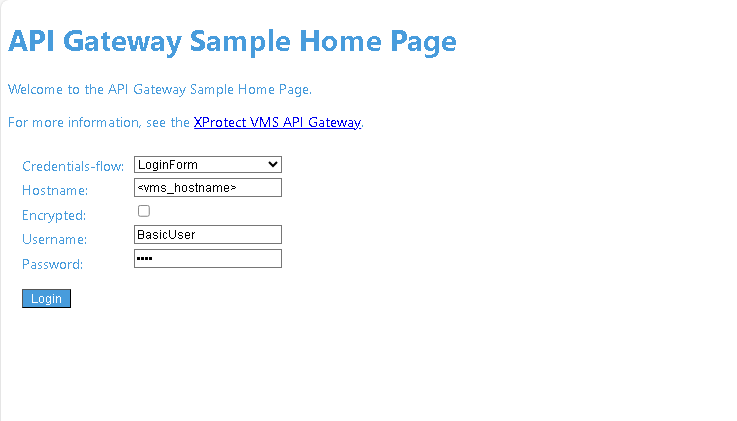
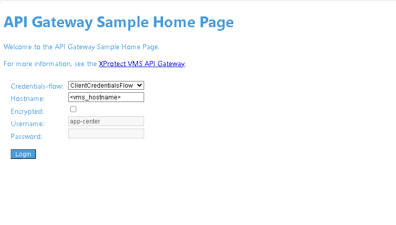
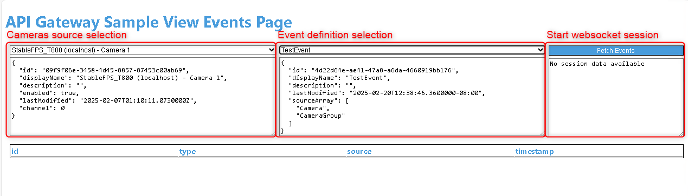
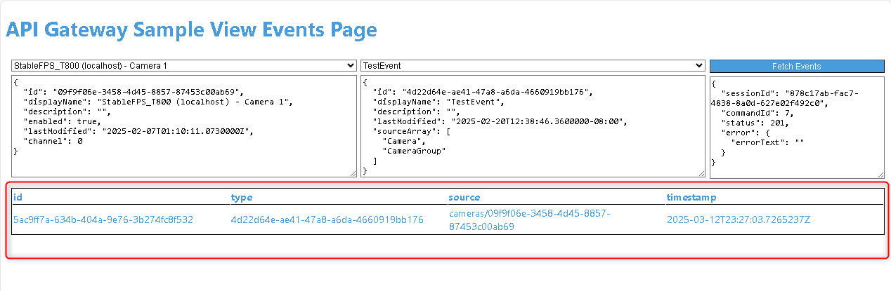

# The API Gateway sample

The *apigateway-sample* sample shows how to consume events using the API Gateway Events Websocket. For more information mind reading the [Events-and-State-WebSocket-API Documentation](https://doc.developer.milestonesys.com/mipvmsapi/api/events-ws/v1/#section/Events-and-State-WebSocket-API).

The sample contains the following files.

```txt
apigateway/
├── containers
│   └── apigateway-sample
│       └── webserver
│           ├── apigateway-webserver
│           │   ├── bin
│           │   │   └── apigateway-webserver
│           │   ├── go.mod
│           │   ├── go.sum
│           │   ├── Makefile
│           │   ├── README.md
│           │   └── src
│           │       ├── cmd
│           │       │   └── main.go
│           │       └── pkg
│           │           ├── constants
│           │           │   ├── constants.go
│           │           │   └── enums
│           │           │       ├── credentialflow.go
│           │           │       └── requestcontent.go
│           │           ├── entities
│           │           │   ├── appcenter
│           │           │   │   └── credentials.go
│           │           │   ├── events
│           │           │   │   ├── analyticevent.go
│           │           │   │   └── wscommands.go
│           │           │   └── vms
│           │           │       ├── analyticeventtype.go
│           │           │       ├── camera.go
│           │           │       ├── server.go
│           │           │       ├── token.go
│           │           │       └── user.go
│           │           ├── handlers
│           │           │   ├── context
│           │           │   │   ├── appctx.go
│           │           │   │   └── appctxs.go
│           │           │   ├── eventsHandler.go
│           │           │   ├── homehandler.go
│           │           │   ├── loginhandler.go
│           │           │   └── viewHandler.go
│           │           ├── repositories
│           │           │   ├── base
│           │           │   │   ├── baseclient.go
│           │           │   │   ├── httpclient.go
│           │           │   │   └── wsclient.go
│           │           │   ├── eventclient.go
│           │           │   ├── gatewayclient.go
│           │           │   ├── idpclient.go
│           │           │   └── tokenDispatcher.go
│           │           ├── services
│           │           │   ├── eventservice.go
│           │           │   ├── gatewayservice.go
│           │           │   └── idpservice.go
│           │           └── view
│           │               ├── embed.go
│           │               └── templates
│           │                   ├── index.html
│           │                   └── view_events.html
│           ├── Dockerfile
│           └── Makefile
├── Makefile
└── README.md
```

## Available features

- **IDP Integration**: Implementation of an http client using the IDP endpoints authenticating using two possible way. A basic user authentication and OAuth 2 Client Credentials Flow.
- **API Gateway Integration**: Implementation of an http client using the API Gateway endpoints to request list of cameras and available analytic events definitions.
- **API Gateway Events WebSocket Integration**: Implementation of a web socket client listening to events of a selected type and related to a selected camera source.
- **App Center Client Credentials flow**: Request client secret to access to other services in the system.
- **Easy Deployment**: Quickly deployable using Helm charts.

## Requirements

Since the sample app uses the client credentials flow, the app center on installation will generate a client secret. The app center won't be able to generate the secret unless it is authorized. That means the user must be an administrator and logged in to the management client. The installation must be done through the Management client UI for the app center. 

To avoid using the UI and for development environment only. We provide you with a script which will acquire two tokens for two different users. One is for the username/password that you enter while installing the App Center. The other one is for the Windows user you are logged in with. So, the script must run in a session where you are already logged in as a Windows administrator. This last part is only needed because the Client Credentials Flow registration currently cannot be authorized by an XProtect basic user. The script will copy to your clipboard two kubectl commands to create k8s secrets with the tokens. The App Center will detect these secrets and use them to generate the Client secret. Hosting the windows user tokens as a k8s secrets is a workaround, so you can operate with the app center without being logged-in to the management client (This option is only needed for development environment and not recommended for production environments).

```powershell
$ErrorActionPreference = "Stop"

Try {
    $Server = Read-Host -Prompt 'Input hostname of Management Server'
    $User = Read-Host -Prompt 'Input username of basic user in the administrator role'
    $Pass = Read-Host -MaskInput -Prompt 'Input password of basic user'

    $Endpoint = "https://" + $Server + ":/IDP/connect/token"

    $Response = Invoke-WebRequest -AllowUnencryptedAuthentication -Uri $Endpoint -Method Post -Body @{
        grant_type = "password"
        username = $User
        password = $Pass
        client_id = "GrantValidatorClient"
    }
    $BUF_AccessToken = ($Response.Content | ConvertFrom-Json).access_token

    $Response = Invoke-WebRequest -AllowUnencryptedAuthentication -Uri $Endpoint -Method Post -Body @{
        grant_type = "windows_auth"
        scope = "write:client"
        client_id = "winauthclient"
    } -UseDefaultCredentials
    $CCF_AccessToken = ($Response.Content | ConvertFrom-Json).access_token

    Set-Clipboard ""
    Set-Clipboard -Append -Value "kubectl create secret generic app-registration-buf-token --from-literal='token=$BUF_AccessToken' --dry-run=client -o yaml | kubectl apply -f -"
    Set-Clipboard -Append -Value "kubectl create secret generic app-registration-ccf-token --from-literal='token=$CCF_AccessToken' --dry-run=client -o yaml | kubectl apply -f -"

    Write-Output "Your clipboard now contains the commands for creating the secrets necessary for using the basic user flow and client credentials flow"
}
Catch {
    Write-Output $_.Exception
}

Write-Host "Press any key to continue"
$void = $host.UI.RawUI.ReadKey("NoEcho,IncludeKeyDown")
```

Expected output:

```bash
kubectl create secret generic app-registration-buf-token --from-literal='token=eyJhbGc...' --dry-run=client -o yaml | kubectl apply -f -
kubectl create secret generic app-registration-ccf-token --from-literal='token=eyJhbGc...' --dry-run=client -o yaml | kubectl apply -f -
```

Note: The generated token has an expiration period of 3600 seconds. If this level of authorization is needed after this period of time. 

## The App sandbox

With the App sandbox developer option enabled, the system will host both a *container registry* and a *helm-charts repository*. These come in handy when you want to run and test your App in a system while still keeping everything local. You can push container images to the sandbox registry by prefixing them with `<system-ip>:5000/sandbox.io/`. These images can be pulled from any helm-charts that is installed in the system. Thus, you can now refer to sandbox container images from your local helm-charts and install it directly with the *helm* command.

The helm-charts itself can also be pushed to the sandbox helm repository which is accessible at `<system-ip>/app-sandbox`. We use [ChartMuseum](https://chartmuseum.com/) as the back-end for this repository and you can read more about how to access the API's [here](https://github.com/helm/chartmuseum?tab=readme-ov-file#api).

Once the helm-charts of an App is pushed to the sandbox repository, it will become visible in the App Center and you can then install, upgrade and uninstall your App from here. Note, that for a helm-charts to be considered an App, it must use the `app-registration` chart as a *subchart* (see the `Chart.yaml` file for how this is done).

## Building and running the apigateway-sample App

The [`Makefile`](./Makefile) located at this same directory provides an convenient way to build and publish both the images and the helm-charts of the sample. Everything published using the `Makefile` will be to the App sandbox running inside the system.

The `Makefile` defines two macros listing respectively the container images and the helm charts to handle.

The last line of the `Makefile` includes the `common.mak` file, which defines a set of useful rules by using the **App Builder** in the background. The most important *targets* defined by these rules are:

```bash
# build container images from source code and helm charts
make build
# push built container images and helm charts to the App sandbox
make push

# install helm-charts in system from local file
make install-chart-from-file
# install helm-charts in system from sandbox repository
make install-chart-from-repo
# uninstall helm-charts from system
make uninstall-chart
```

#### From the Docker view
So, to build the sample, you must navigate your terminal to the directory of the `Makefile` and then run the command

```bash
make build
```

After a successful build, running `docker images` should now give you output similar to what is shown below

```txt
REPOSITORY                                                     TAG       IMAGE ID       CREATED         SIZE
<system_ip_addr>:5000/sandbox.io/apigateway-sample/webserver   1.0.0     78f2c9d669b6   6 seconds ago   11.8MB
```

Here you can see that the image is named in accordance with the sandbox container registry hosted inside the system. Also you can see that the image is tagged with version `1.0.0` which is the version used in the `Makefile` (the version used in the `IMAGES` macro).

If you are curious what happens behind the scene when running `make build`, then you can add the `-n` command line parameter. This will instruct `make` to not build the image, but instead just show the commands that it would have executed in order to do the build. For the above case you should see output similar to this when running `make -n build`

```bash
docker build containers/apigateway-sample/webserver -t <system_ip_addr>:5000/sandbox.io/apigateway-sample/webserver:1.0.0
```

You can use the `-n` option for all the other make targets as well.

To push the image and helm charts to the sandbox registry, run the command

```bash
make push
```

To verify that the push worked, you can first remove the version you already have in the local cache and then try to pull it again from the sandbox. Remember to replace the system IP address below to match the one you are using.

```bash
docker rmi <system_ip_addr>:5000/sandbox.io/apigateway-sample/webserver:1.0.0
docker pull <system_ip_addr>:5000/sandbox.io/apigateway-sample/webserver:1.0.0
```

#### From the Chart view
The sandbox images can also be pulled from within the system and this is exactly what the helm-charts does. So, let us now build the helm-charts and test that it works. You build the helm-charts by running

```bash
make build
```

You will notice that there will now be a file named `apigateway-sample-1.0.0.tgz` in the `helm-charts` directory.

```txt
apigateway/
└── helm-charts
    ├── apigateway-sample
    └── apigateway-sample-1.0.0.tgz   <---- helm-charts package
```

This is a file that contains the entire helm-charts as one re-distributable package. The version number `1.0.0` comes from the `Chart.yaml` file which is updated by the `Makefile` from the `CHARTS` macro. To push the package to the sandbox repository, run the command

```bash
make push
```

You should get output similar to what is shown below:

```txt
{"error":"remove /tmp/charts/apigateway-sample-1.0.0.tgz: no such file or directory"}
{"saved":true}
```

To confirm that your helm-charts has been uploaded successfully, you can run the command

```bash
make list-charts
```

You should get output similar to what is shown below

```yaml
apiVersion: v1
entries:
  apigateway-sample:
  - apiVersion: v2
    appVersion: 1.0.0
    created: "2025-03-10T13:47:37.759943427Z"
    dependencies:
    - name: app-registration
      repository: https://horizonsystem.azurewebsites.net/system
      version: 1.3.0
    description: Sample using the api gateway
    digest: 3e0ca7922fe1489b6fb18d70435d2e09f039da8609c9bf677dda5afe391357b7
    name: apigateway-sample
    type: application
    urls:
    - charts/apigateway-sample-1.0.0.tgz
    version: 1.0.0
generated: "2025-03-10T13:47:38Z"
serverInfo: {}
```

At this point the App should be visible in the App Center and you can install / upgrade and uninstall it from here.

As an alternative you can also install the App directly from the terminal. There are two targets available

```bash
make install-chart-from-file
make install-chart-from-repo
```

The first will install the chart directly from the helm-charts file you built locally. In the above case, it would install the chart from the file named `apigateway-sample-1.0.0.tgz` in the `helm-charts` directory.

The second will install the chart from the sandbox repository; so basically the same as what would happen if you install the App from the App Center. For this to work, you of course have to push the chart first, like we did with the command `make push-chart`.

To verify that the apigateway-sample App is running, navigate your browser to `https://<system-ip>/apigateway-sample-webserver/`. You will see at first a login page, where you can shows to whether use the ClientCredentialsFlow or a normal login using a basic user. Check the [Using Authentication](#using-authentication) section.

There is one final target available named `uninstall-chart` which can be quite helpful. It does what it says; it simply uninstalls the apigateway-sample chart from the system.

## Using Authentication

Milestone API Gateway requires for most of its endpoint an authentication bearer token included in the request header. In this sample we are showing two possible ways. One using a basic user login page and the Client Credentials Flow integrating with the app center.

### Exposing a basic user login form

This sample show casing a normal token request forwarding some user credentials in the request header. This sample show this option only for the sake of demonstrating the login functionality integrating with the Identity provider. The Identity Provider gets installed alway along side the Milestone XProtect Management Server [For more information you can find this Get started section useful](https://doc.developer.milestonesys.com/mipvmsapi/api/config-rest/v1/#section/Introduction/Get-started).

### Using the Client Credentials Flow integrating with the App Center

The `OAuth 2 Client Credentials Flow` authorization is the Recommended approach for this kind of service to service communication. An app integration has the option to request a client credentials. To do that you will need to add the following section to your values.yaml file for the helm-charts configurations.

```yaml
app-registration:
  credentials:
    clientCredentialsFlow:
      secret: "app-client"                                # K8s secret name
      clientID: "09da6440-e308-31a0-963e-1af823e76a33"    # Random GUID
      clientName: "apigateway-sample-service"             # A client name
      clientScopes: ["managementserver"]                  # A defined scope, you can use the managementserver scope for full admin access to the system
```

When this values are specified in the `values.yaml` file. The App Center, will create a client secret that the app integration can use. The secret will be available through a secret in K8s that will be created at the same namespace for the integrating app. The secret name will be as specified in the values above `app-client`.

One way of consuming this secret would be as demoed in this sample by converting it to a volume and mounting it to the container that needs to use the client ID and secret. Also, feel free to use the following guide from Kubernetes - [Define container environment variables using Secret data](https://kubernetes.io/docs/tasks/inject-data-application/distribute-credentials-secure/#define-container-environment-variables-using-secret-data) - to mount the secrets as environment variables. 

```yaml
      volumes:
      - name: app-client
        secret:
          secretName: app-client
```

The service mounted with the app-client volume will have available the following filles mounted to `/etc/app-client/` directory.

The file `/etc/app-client/client-id` with the client id provided previously "09da6440-e308-31a0-963e-1af823e76a33".
The file `/etc/app-client/client-secret` with the generated secret.

The service with access to this credentials can now ask the IDP for an access token with the given scope. This token will allow this app to connect with tha Api Gateway and access to its endpoints.

This sample code provides an example implementation in golang of an http client using the IDP endpoints. Explore the following code for more information [idpclient.go](./containers/apigateway-sample/webserver/apigateway-webserver/src/pkg/repositories/idpclient.go).

## How to use the app

The app showcases how to use the IDP, Client Credentials Flow and API Gateway Events WebSocket.

### Login page

#### Basic user

The login page, provides two possible ways of logging in. The default approach using the basic user login. You will have to provide a username and password.

This is an example of the login page using the basic user login form.



The app requests the token using an HTTP request similar to the following curl command:

```bash
curl --request POST \
--url <management_server_url>/IDP/connect/token \
--header 'content-type: application/x-www-form-urlencoded' \
--data grant_type=password \
--data username=<username> \
--data password=<password> \
--data client_id=GrantValidatorClient
```

Mind filling the values \<management_server_url\>, \<username\> and \<password\> with the correspondent values for your system.

Expected response:

```json
{
  "access_token":"eyJhbGc...",
  "expires_in":3600,
  "token_type":"Bearer",
  "scope":"managementserver"
}
```

#### Client Credentials Flow

This is an example of the login page using the Client Credentials Flow.



The app requests the token using an HTTP request similar to the following curl command:

```bash
curl --request POST \
--url <management_server_url>/IDP/connect/token \
--header 'content-type: application/x-www-form-urlencoded' \
--data grant_type=client_credentials \
--data scope=managementserver \
--data client_id=<client-id> \
--data client_secret=<client-secret>
```

Mind filling the values \<management_server_url\>, \<client-id\> and \<client-secret\> with the correspondent values for your system.

Expected response:

```json
{
"access_token": "eyJhbGc...",
"expires_in": 3600,
"token_type": "Bearer",
"scope": "managementserver"
}
```

### Events websocket page

Once logged in, the user can subscribe by selecting a camera from the cameras drop down and an events definition from the events drop down.



Once clicked on the `Fetch Events` button, a new web socket session will be created. Any previous session will be closed immediatly. Once the session is created, the app is now listinig to the API Gateway events websocket `<management_server_url>/api/ws/events/v1/`.

To test the websocket functionality. Once the session is open. In the managementy client, you can navigate to the `Rules and Events->Analytic Events` node.


And we can see the test events bieng listed in the app events view.



### Next

- Cameras settings page (TO BE Implemented) integrating with the app center app settings page
