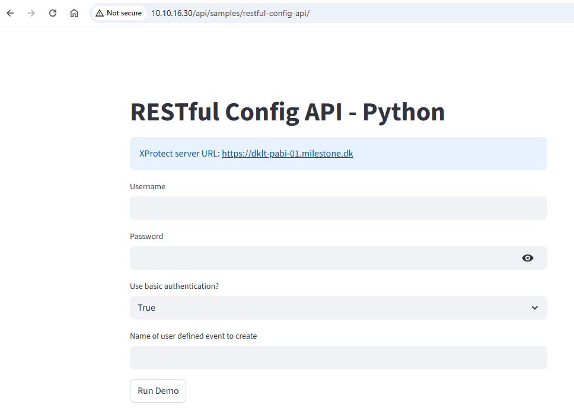

# RESTful Config API Sample

A sample application demonstrating how to use the XProtect API Gateway from a Python application. The sample logs into the server, creates, gets, updates, and deletes a user-defined event, with diagnostic output along the way. The sample uses [Streamlit](https://streamlit.io/) for creating a web interface.



## Prerequisites

- XProtect installation
- The API Gateway installed on the same host as the management server
- A user with the Administrators role
- Python version 3.10 or newer

## Environment Setup

### Environment Variables

This sample is designed to run in a container where the following environment variables are provided by the container runtime:

| Variable | Description | Example |
|----------|-------------|---------|
| `SYSTEM_IDENTITY_PROVIDER` | URL of the Identity Provider | `https://your-management-server.com/IDP` |
| `LEGACY_USE_TLS` | Whether XProtect server uses TLS | `true` or `false` |
| `LEGACY_MANAGEMENT_SERVER` | Management Server hostname | `your-management-server.com` |

For local development, set these variables in the `.env` file.

### Local Development Setup

1. **Copy environment configuration:**
   ```bash
   # Linux/macOS/Git Bash
   cp .env.example .env
   ```
   ```powershell
   # Windows PowerShell
   Copy-Item .env.example .env
   ```
   ```cmd
   # Windows Command Prompt
   copy .env.example .env
   ```

2. **Configure your environment:**
   Edit the `.env` file with your XProtect server details:
   ```env
   SYSTEM_IDENTITY_PROVIDER=https://your-management-server.com/IDP
   LEGACY_USE_TLS=true
   LEGACY_MANAGEMENT_SERVER=your-management-server.com
   ```

3. **Install dependencies:**
   ```bash
   cd containers/restful-config-api
   pip install -r requirements.txt
   ```

4. **Run the application:**
   ```bash
   streamlit run main.py
   ```

### Container Deployment

**Build the Docker image:**
```bash
docker build -t restful-config-api:1.0.0 -f containers/Dockerfile .
```

**Run the container:**
```bash
docker run -p 8501:8501 \
  -e SYSTEM_IDENTITY_PROVIDER=https://your-management-server.com/IDP\
  -e LEGACY_USE_TLS=true \
  -e LEGACY_MANAGEMENT_SERVER=your-management-server.com \
  restful-config-api:1.0.0
```

### App Center Deployment

Use the make commands described in the top-level README file to build and manage the sample.

When deployed through App Center, environment variables are automatically configured and should not be set manually. Remove the `.env` file before building and pushing your sample application to App Center.

## Project Structure

```
restful-config-api/
├── .env.example                    # Environment variables template, only needed for local development
├── app-definition.yaml             # App Center configuration
├── Makefile                        # Build automation
├── containers/
│   └── restful-config-api/
│       ├── Dockerfile              # Container build instructions
│       └── app/
│           ├── requirements.txt    # Python dependencies
│           └── src/
│               ├── __init__.py
│               ├── main.py         # Main application code
│               ├── api_gateway.py  # API Gateway client
│               └── identity_provider.py # Authentication handler
└── README.md                       # This file
```

## Porting Existing Python MIP Integration

This sample was ported from the existing protocol integration sample [RestfulCommunicationPython](https://github.com/milestonesys/mipsdk-samples-protocol/tree/main/RestfulCommunicationPython).

### Steps to Port Your Python Integration:

1. **Create requirements file:** List all packages needed for pip installation based on your sample documentation

2. **Add Streamlit web interface:** 
   - Convert console application to web app using Streamlit
   - Add `streamlit` to your requirements.txt

3. **Test locally:**
   - Verify your sample works as a web application
   - Test all functionality through the web interface

4. **Containerize:**
   - Create Dockerfile following this sample's pattern
   - Test that your sample works in Docker container locally
   - Reference: [Streamlit Docker deployment guide](https://docs.streamlit.io/deploy/tutorials/docker)

5. **Deploy to App Center:**
   - Once container testing is successful, you can build, push, and install your application in the App Center